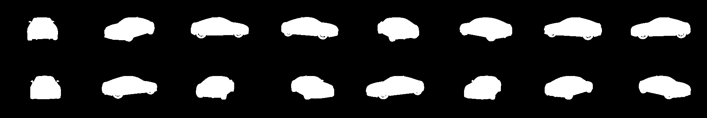
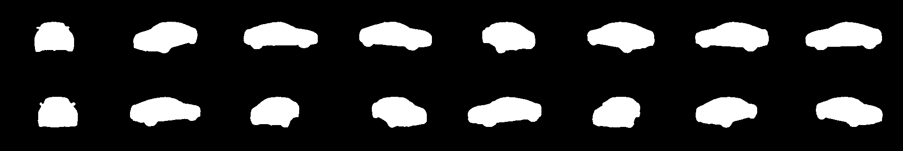

# U-NET model for Carvana dataset image segmentation

## NOTE

I do not recommend anyone taking this project as a base or reference for them. This was **my first contact with DNN and CNN**, so this work contains many things that I think **should be improved**. This project was developed during my Erasmus+ stay at CTU Prague.

## Introduction

This projects is inspired in the kaggle competition "Carvana Image Masking
Challenge", where the main goal is to segment cars from a constant background.

This project has been built and trained in Google Collab. Hence, the main file of the project is a jupyter notebook, [CarvanaUNETColab.ipynb](CarvanaUNETColab.ipynb), which calls to the 4 python scripts which compose the code part of the project.

## Test Sample
#### From a car in 16 orientations, this is the perfect mask:

#### And this is the mask predicted by one experimental run of the model:

## Scripts

### Script [unet.py](scripts/unet.py)
This script implements a modification of the model described in the paper "U-Net: Convolutional
Networks for Biomedical Image Segmentation".

Two relevant modifications have been applied to the original U-NET model:

-The first one is that in the model used for this project the convolutional layers are padded.

-The second one is that batch norm is applied after each convolution.

## Script [data.py](scripts/data.py)
This is the simplest script of the whole project. In this script the dataset will be prepared to be used
to train our model.

## Script [train.py](scripts/train.py)

This is the main script of the project. As it’s name indicates it’s used to train the model and will call
every other script. This script has many parameters that can be modified by the user to find the best
configuration for the dataset and the system in which the model is trained. Some parameters that
should be remarked are:

• Batch size  
• Image width  
• Image height  
• Number of epochs  
• Train images, train msks, tests images and test mask directories  
• Learning rate  
• Load project (boolean)

## Script [extra.py](scripts/extra.py)

This scripts implements some utility functions such as:

• Saving and loading checkpoints (Due to 
storage limit not included in this repository).  
• Calculating accuracy and Dice score  
• Saving predictions as images

## Experimental part

In this section 2 parameters and one feature of the model will be changed and combined in 6 experimental trainings of 10 epochs. Specifically the model will be trained with:

• Four different learning rates  
• Two different batch sizes  
• Two different convolution kernel sizes

For full information about these experiments read the full [memory](/memory.pdf)

## References
- [Ronneberger, O., Fischer, P. & Brox, T. (2015). U-Net: Convolutional Networks for Biomedical Image Segmentation](https://arxiv.org/abs/1505.04597)  

- [Ioffe, S. & Szegedy, C. (2015). Batch Normalization: Accelerating Deep Network Training by Reducing Internal Covariate Shift](https://arxiv.org/abs/1502.03167)

